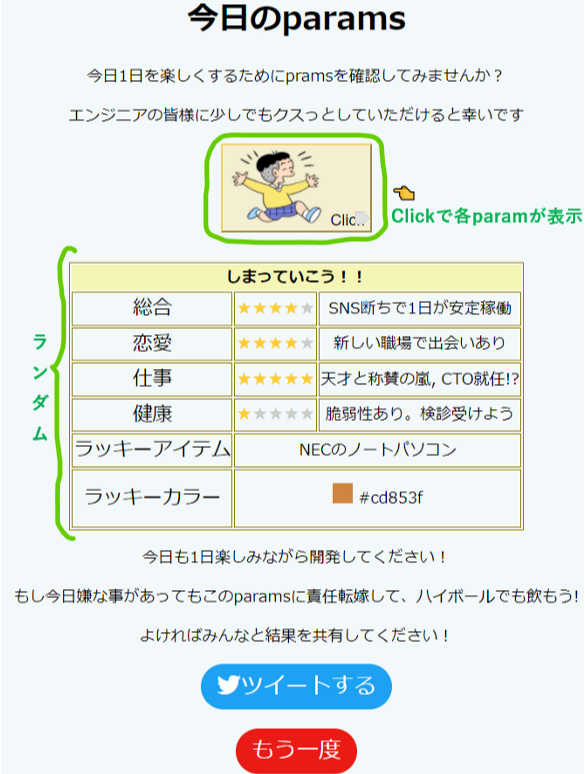

# 今日のparams

### > なんぞや
ITおみくじ([こちら](https://itomikuji.com/))を参考に作成した、**占い**です.  
paramsとした理由は, 人を関数と見立てて日々関数のパラメータが更新されるイメージでparamsと名づけました。

# コンセプト
私が大切にしたいことは**幸せの量産の前に、エンジニアの幸せを.**
#### How?
自由な服装・フラットな組織・自由な働き場所 etc  
外面だけにとらわれがちですが, ほんとにそれだけでいいのでしょうか？  
**インポスター症候群**や**サザエさん症候群**など内面の問題もたくさんあるのだと思います。

#### 内面にアプローチしてみると
何気なく仕事を始めるより、漫画や他の人と話して笑った後の方が集中力が増す？  
**しかし**,漫画や本は好みが違いや、他の人と話すにも話題がないことも・・・   
**こんな時, 一人でもクスっとできて, 人を選ばないネタはないか！？**

#### 過去にも
今でこそ写真がふんだんに使用されていて見やすくなっている新聞ですが, かつては活字ばかりだったそう.  
面白さが少なく, 心も荒んでいく中, 4コマ漫画の登場により変化が・・・
何気ない漫画があることで、荒んだ心が和む！との声が。

**占いでエンジニアが"クスっ"とできるようなwebのコボちゃんを作ってみよう！**

# 全体像

**※この占いはなんの決まりにも則っておりません！！**  
　成功したときは自信に, 失敗したときは半分をこのページに八つ当たりをして,  
　明日に持ち越さないようにしてください！

# 工夫したところ
* 変更を加えない配列・オブジェクトやrandam値を取得する関数など変更頻度が少ないものは
  APIとして別のjsファイルにまとめた.
* ページ全体をコボちゃん風の配色で統一.
* switch case文を使って, 場合分けをわかりやすくした。
* ツイートボタンを埋め込み, 他の人とシェアできるようにした. 
  後々は別のチャットツールに投稿できるようにして、開発チームの会話のネタになったらいいな・・・

# まとめ
今回の教育を通して, JavaScriptの基本文法, TDD, インポスター症候群など, プログラミングだけでなく開発手法や, メンタル的な要素まで幅広く学ぶことができました。  
また、ペアプロでは, 自分が考え付いた以外の手法や便利なコマンド・メソッドの情報共有など, 自己学習や単独での開発ではできない体験をできたと感じました。  
### 今後の取り組み 
* ナイトメアを全部やる
* webデザインを極めてみたい → reactとか?
* 業務での活用。→ 障がい者モビリティの運用, ご家族が安心できるページを作ってみたい。

## 謝辞
DIGの講師の皆様, 事務局, 支えてくださったクラスの皆様, とても有益な時間をありがとうございました。
また,　私をこの教育に送り出し,負荷を請け負ってくださった職場関係者の皆様へも心から感謝申し上げます。  
明日からフォローアップ期間に入りますが, 変わらぬご支援のほどどうぞよろしくお願いいたします。